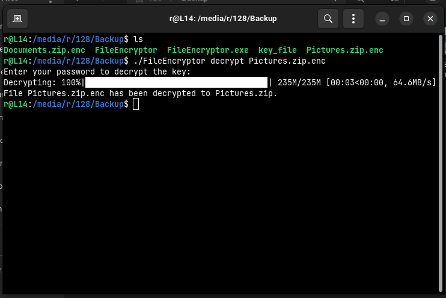

# FileEncryptor Program

## Overview

This File Encryption Program is a Python-based tool designed to securely encrypt and decrypt large files using a
password-derived key. It employs robust cryptographic methods, including PBKDF2 with SHA-256 for key derivation and
AES-GCM for encryption, making it suitable for processing large files efficiently.

## Features

- **AES-GCM Encryption**: Utilizes AES-GCM for secure and efficient encryption, suitable for large files.
- **Password-Based Encryption**: Generates a secure encryption key based on a user-provided password.
- **File Encryption and Decryption**: Encrypts files with a `.enc` extension and decrypts them back to their original
  state.
- **Chunked File Processing**: Processes files in chunks to efficiently handle large files without excessive memory
  usage.
- **Progress Bar**: Displays a progress bar during encryption and decryption processes for better user feedback.
- **Secure Key Management**: Securely stores the encryption key in an encrypted file, ensuring access only for the
  password holder.



## Requirements

- Python 3.x
- Cryptography library

## Installation

1. Ensure Python 3.x is installed on your system.
2. Install required Python libraries:
   ```
   pip install -r requirements.txt
   ```

## Usage

Navigate to the program's directory in the command line and use the following commands:

1. **Encrypt a File**:
   ```
   python3 ./FileEncryptor encrypt <file_path>
   ```
   This command encrypts the specified file and saves it with a `.enc` extension.

2. **Decrypt a File**:
   ```
   python3 ./FileEncryptor decrypt <file_path>.enc
   ```
   This decrypts the specified `.enc` file back to its original format.

### First Run

- The program prompts the user for a password to generate a secure encryption key upon first execution.

### Subsequent Runs

- Enter the same password used during the first run to decrypt the key file and access the encryption/decryption
  functionality.

## Security

- Employs `750000` iterations in the key derivation process for enhanced security.
- The master key is securely stored in an encrypted file, accessible only with the correct password.

## Disclaimer

- This tool is intended for educational purposes and should be thoroughly tested before using it for sensitive data.

## License

[](https://opensource.org/licenses/MIT)

## Detailed breakdown

1. Key Generation (generate_key function):

    - The generate_key function takes a password string and an optional salt as input.
    - If no salt is provided, a random 32-byte salt is generated using os.urandom(32).
    - The function then uses the PBKDF2-HMAC-SHA256 key derivation function to derive a 32-byte key from the password and salt. PBKDF2 applies a pseudo-random function to the input password multiple times (specified by the iterations parameter) to generate a derived key.
    - The derived key and the salt used for key derivation are returned as a tuple.

2. Key Encryption (encrypt_key_file function):

   - The encrypt_key_file function takes a key and a password as input.
   - It generates a new key and salt pair using the provided password and the generate_key function.
   - It then uses the generated key to encrypt the original key (provided as input) using AES-GCM (Galois/Counter Mode), which is an authenticated encryption mode.
   - The salt, nonce (a unique value used once), and the encrypted key are written to a file named "key". The salt and nonce are prepended to the encrypted key to ensure that they are available during decryption.

3. Key Decryption (decrypt_key_file function):

   - The decrypt_key_file function takes a password as input.
   - It reads the salt, nonce, and encrypted key from the "key" file.
   - It uses the provided password and salt to generate the key using the generate_key function.
   - It then decrypts the encrypted key using AES-GCM and returns the decrypted key.

4. File Encryption (encrypt_file function):

   - The encrypt_file function takes a file path and a key as input.
   - It uses the provided key to encrypt the contents of the specified file using AES-GCM.
   - The encrypted file is written to a new file with the ".enc" extension appended to the original file name.
   - Progress of the encryption process is displayed using the tqdm library, which provides a progress bar.

5. File Decryption (decrypt_file function):

   - The decrypt_file function takes a file path and a key as input.
   - It reads the contents of the specified encrypted file.
   - It extracts the nonce from the beginning of the file.
   - It uses the provided key and nonce to decrypt the file contents using AES-GCM.
   - The decrypted file is written to a new file with the ".enc" extension removed from the original file name.
   - Progress of the decryption process is displayed using the tqdm library.

6. Main Functionality (main function):

   - The main function serves as the entry point of the program.
   - It checks the command-line arguments to determine whether to encrypt or decrypt a file.
   - If the "key" file does not exist, it prompts the user to enter a password to generate the key and encrypt it.
   - If the "key" file exists, it prompts the user to enter a password to decrypt the key.
   - It then performs the specified encryption or decryption operation on the specified file using the derived key.

Overall, the program provides functionality for securely generating keys from passwords, encrypting and decrypting files using those keys, and handling user input securely. It follows best practices for key management and encryption, making it suitable for protecting sensitive data.

## Key file 
The "key" file contains the encrypted `master key`, which is derived from the user-provided password using a key derivation function (KDF) with a salt. This `master key` is then used to encrypt and decrypt files using the AES-GCM symmetric encryption algorithm.

However, the master key itself cannot be directly used to decrypt files. Instead, it needs to be decrypted first using the correct password provided by the user. Once the `master key` is successfully decrypted, it can be used to perform encryption and decryption operations on files.

This approach adds an additional layer of security because even if an attacker gains access to the encrypted `master key`, they would still need the correct password to decrypt it and gain access to the actual encryption/decryption functionality.

In summary, the `master key` serves as the key to unlock the encryption/decryption capabilities of the program, but it requires the correct password to be usable. Without the password, the `master key` remains securely encrypted and unusable for decryption purposes.